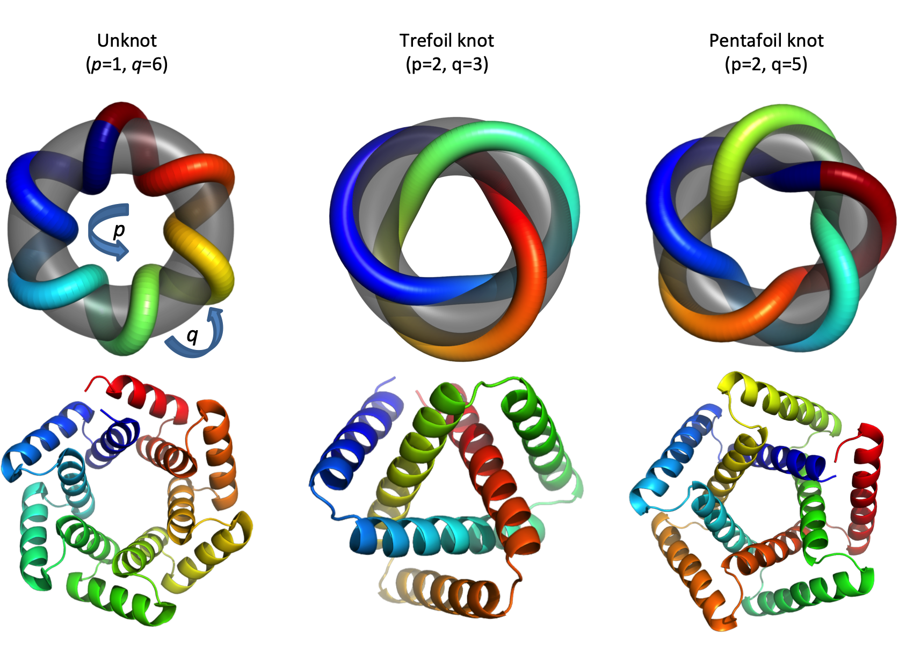

# knotted_designs

Supporting materials for manuscript on the design of knotted proteins.

# License

Before using this software, please obtain a license (free for academic users)
for the Rosetta macromolecular modeling suite. Information on licenses can be
found here: https://rosettacommons.org/software/license-and-download

# Disclaimer

First, it's important to realize that back in the dark ages of protein design
(pre 2020) it took many, many thousands of CPU hours to generate good design models.
This is because the approaches for backbone topology sampling were essentially
brute force random sampling of helix lengths and loop torsions. So we relied on
many independent simulations, each several minutes long, to inefficiently explore
the very large space of structures and sequences. All the calculations described
in this paper were run on a large computing cluster.

Second, this design code is a bit old (some of the original trefoil simulations date
back to 2015), and was written on a branch of the Rosetta package during a time
of rapid change in the framework for modeling symmetric systems (like these
tandem repeat proteins). Unfortunately, the code became stranded on this branch
and was never integrated into the main trunk of Rosetta. For that reason, it's not
available as a mode of the publicly released modeling package. This means that
right now, it's only available as a binary executable (download link below).
However, Rosetta is currently being transitioned to free open source software, which
should make it possible to release the code on this branch in a form that
anyone could compile for themselves.

Third, I wouldn't personally recommend that anyone actually use this design code for
new design calculations, since design methods have advanced so dramatically in the
past couple of years. The key concept in this paper is very simple: that you can
get a $(p,q)$ torus-knot backbone by designing a $q$-repeat protein with
a repeat-repeat rotation angle of $p * 360/ q$ degrees. This would be straightforward to
implement in some of the modern hallucination- or diffusion-based approaches to
tandem repeat protein design. Also, we've included a large set (~60k) of
pre-built trefoil and pentafoil design models in the download below.

# Repository contents:

* `trefoil_flags.txt` and `pentafoil_flags.txt`:
Command line flags for running the first-round design calculations,
in which we explore a range of different helix lengths.
See the `Running` section below for details of what
the command line would look like.

* `trefoil_resampling_flags.txt` and `pentafoil_resampling_flags.txt`:
Command line flags for running the second-round
design calculations, in which we focus in on specific helix lengths and
backbone turn conformations.

* `input/` Folder with input files for the calculations.

* `src/` Folder with C++ files that, together with the Rosetta library
source code, implement the design calculations. In this folder are `symdes.cc`
which is the main executable file, and a few supporting `*.hh` files. 

# Download links for other large input files, precompiled executable, and
60,000 pre-built models.

## big_input

Some of the inputs for the design calculation (for example, the file of
backbone fragment torsion angles) are too big to host on github, so we
combined them all into a big ZIP file, downloadable here:

...

After downloading the file, move it into this folder and uncompress it, for example
with the command

`tar -xzf big_input.tgz`

## binary

A pre-compiled binary for linux is available here:

...

## pre-built models

A large set of trefoil and pentafoil design models can be downloaded here:

...

# Running the calculations:

# Other relevant software:

## Protein-MPNN
For the second round of pentafoil design calculations, we used the Protein-MPNN
neural network to select new sequences starting from the backbones of the
original design models.

https://github.com/dauparas/ProteinMPNN

## AlphaFold
For selecting second round pentafoil designs we modeled their structures with
AlphaFold and looked for sequences that were predicted to fold into the desired
topology.

https://github.com/deepmind/alphafold

